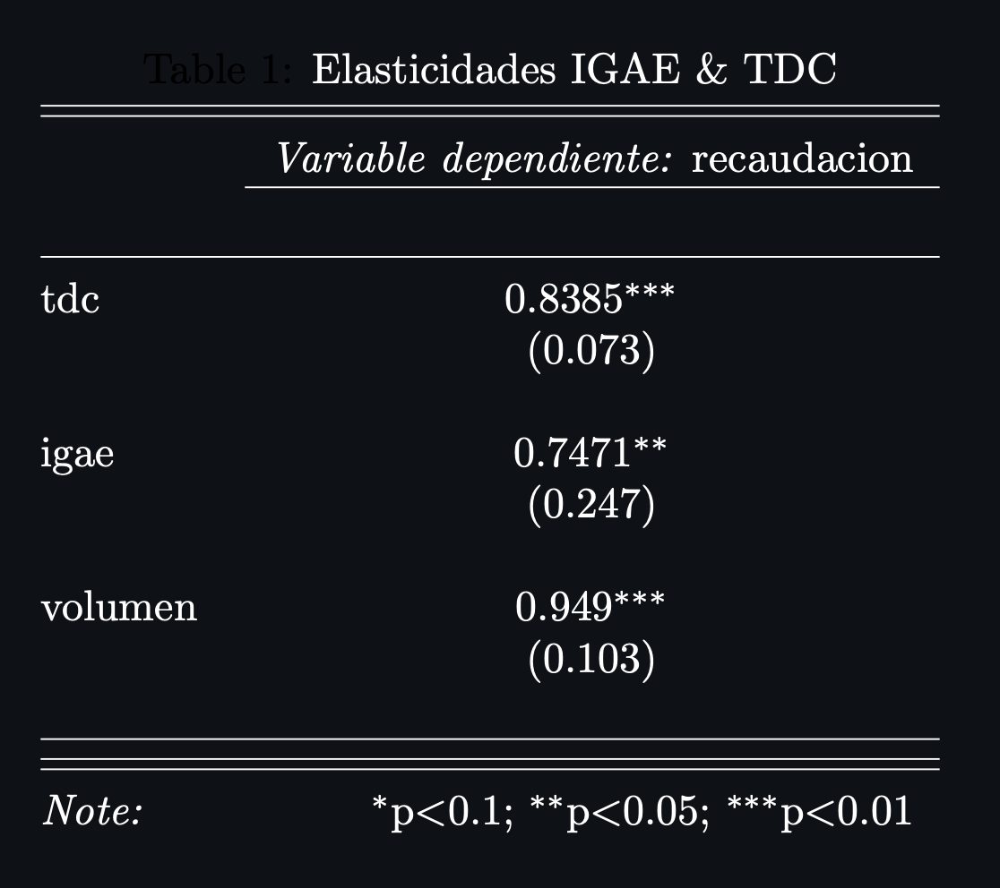

# Nota Metodológica

**Objetivo:** Transformar los datos nominales de recaudacion de modo que se puedan realizar comparaciones interanuales directas, así como estimar el esfuerzo recaudatorio realizado por las autoridades mexicanas.

La informacion nominal de recaudacion por aduana refleja el aumento en la recaudación entre distintos periodos de tiempo, pero estos aumentos reflejan tambien condiciónes macroeconomícas externas que complican la comparación directa de cifras de recaudacion entre distintos periodos de tiempo. La metodologia expuesta a continuacion tiene el objetivo de _separar_ el efecto de dichas condiciones macroeconomicas (particularmente el efecto de aumentos nominales en el Tipo de Cambio MXN/USD y el efecto del crecimiento económico de México).

Las variaciones porcentuales entre periodos en el Tipo de Cambio y el Crecimiento Económico capturan una parte del ajuste que debe realizarse, sin embargo, no podemos asumir el traslado completo de estas variaciones a la recaudacion. 
* **Tipo de Cambio:** Aumentos en el TDC nominal generan un efecto en dos direcciónes sobre la recaudación. Por un lado, estos incrementos aumentan el valor nominal de las mercancías que se importan, de modo que los impuestos que dependen del valor de dichas mercancias tambien aumentan. Por otro lado, existe un efecto de opuesta direccion sobre la demanda de bienes importados, en tanto que sus precios relativos aumentan ante devaluaciónes del TDC.
* **Crecimiento Económico:** El crecimiento económico interno refleja cambios en la actividad económica nacional. Sin embargo, estos cambios solo se traducen en la recaudacion a partir del aumento en la demanda de productos importados.

En consecuencia, nos interesa conocer el **nivel de respuesta** de la recaudacion respecto al TDC y el Crecimiento Económico (dada la periodicidad de las estimaciones del PIB, usamos el Indice Global de Actividad Económica, publicado por el INEGI, como proxy). Para tal fin, estimamos la **elasticidad de la recaudacion** con respecto a cambios en el IGAE y el TDC. El procedimiento general para el ajuste consiste en lo siguiente:

1. Deflactamos las cifras nominales de recaudacion utilizando el Indice de Precios al Consumidor (INPC) reportado mensualmente por el INEGI. (Estos valores se presentan en el tablero como las cifras reales).
2. Utilizamos una Regresión Lineal (_log_-_log_) con efectos fijos por aduana y errores estándar corregidos por heteroscedasticidad para estimar la respuesta porcentual de la recaudacion ante cambios porcentuales unitarios en el IGAE y el TDC.
3. Estimamos variaciones porcentuales con respecto a un periodo base (mismo día del año anterior) para la serie de IGAE y TDC. Después utilizamos la elasticidad calculada anteriormente para estimar el efecto de dichas variaciones en la recaudacion.
4. Restamos la magnitud del efecto a las cifras contemporaneas, de modo que son directamente comparables. La diferencia entre la recaudacion nominal y la recaudacion ajustada por dicha diferencia corresponde al esfuerzo recaudatorio.

A continuacion describimos con más detalle este procedimiento.

### Estimaciones de Elasticidades

Utilizando cifras desestacionalizadas para el caso del IGAE y el Volumen de Importaciones, y reales para el Tipo de Cambio, modelamos las variaciones porcentuales en la recaudación contemporanea por Impuesto como una función lineal de las variaciones porcentuales en el IGAE, el Volumen de Importaciones y el Tipo de Cambio:

$$\Delta\log(rec_{i,t}) = \alpha_i + \gamma_{TDC} \Delta\log(TDC_{t}) + \gamma_{IGAE} \Delta\log(IGAE_t) + \beta vol_{i,t} + \varepsilon_{i,t} $$

Dado el planteamiento del modelo, los coeficientes $\gamma_{TDC}$ y $\gamma_{IGAE}$ pueden interpretarse como las elasticidades (respuestas porcentuales) de la recaudacion con respecto al Tipo de Cambio y el Indice Global de Actividad Económica. En este modelo $\alpha_i$ corresponde a un efecto fijo por aduana, que permite la estimacion de distintos interceptos para cada una de las aduanas. Los resultados de este modelo se presentan a continuacion.

